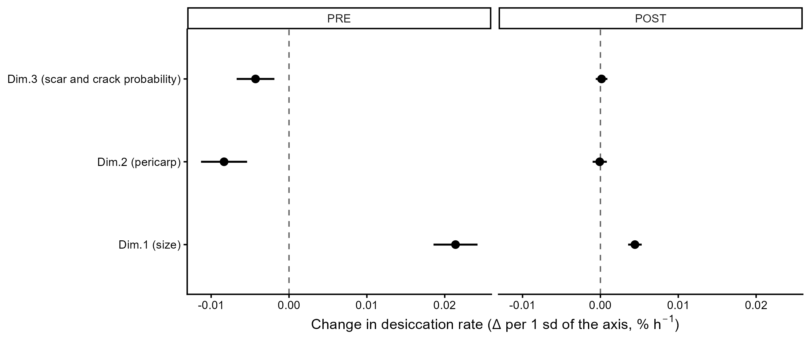
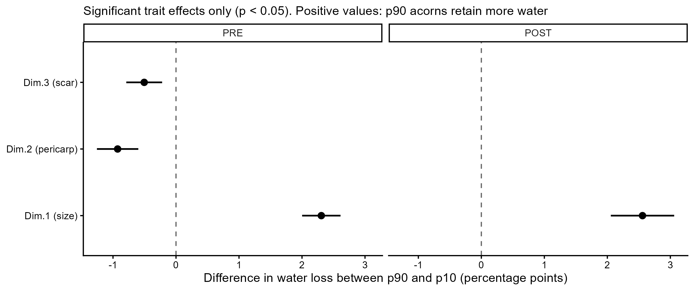
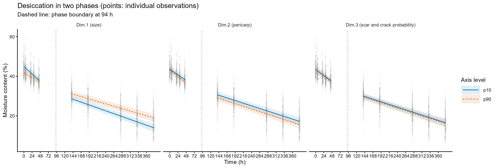

```{r setup, include=FALSE}
if (!file.exists("00-data/processed/desiccation_traits_long.csv")) {
  knitr::opts_knit$set(root.dir = "..")
}
suppressPackageStartupMessages({
  library(tidyverse)
  library(knitr)
})
```

# Resumen

Las bellotas de *Quercus* pierden agua a ritmos distintos, y la velocidad de esa
pérdida depende de las características del fruto: tamaño, grosor del pericarpo y
tamaño de la cicatriz de abscisión. Este informe presenta el **modelo de
referencia** con el que se defendieron estos resultados, y resume la
comprobación de que las conclusiones no cambian al introducir la filogenia.

**Modelo**: `Moisture_content ~ time_s * (Dim.1 + Dim.2 + Dim.3) +
(0 + time_s | species) + (1 + time_s | prov_code) + (1 | id_bellota)`, ajustado
por separado en la fase lineal (PRE, *t* < 94 h) y en la de equilibrio (POST,
*t* > 94 h) con glmmTMB. Los tres ejes morfológicos proceden de un FAMD sobre
medidas originales de bellotas, y las dos fases se modelan aparte porque
la dinámica de la desecación cambia de signo: pierde peso de forma rápida al principio y lenta posteriormente.

**Hallazgo central**: los rasgos modulan la **velocidad** de desecación en la
fase lineal, pero en la fase POST solo es importante el tamaño de la bellota.
En PRE, un pericarpo más grueso y una cicatriz mayor aceleran la pérdida de agua,
mientras que una bellota mayor se seca más despacio.
En POST, esos efectos sobre la pendiente desaparecen.

**Sobre la heterogeneidad entre especies**: la velocidad de desecación es
claramente heterogénea, y esto no es un inconveniente del modelo sino parte del
fenómeno. Se modela con **pendientes aleatorias por especie** en lugar de con
coeficientes fijos por especie. La heterogeneidad queda descrita como varianza:
un efecto del rasgo por cada una de las 8 especies no sería discutible con la
información disponible.

Conviene precisar *qué* heterogeneidad es esa, porque aquí hay una sutileza que
condiciona la lectura de las cifras. `prov_code` está anidada en `species` (15
códigos en 8 especies), de modo que **las varianzas de pendiente de los dos
niveles no están identificadas de forma única**: cualquier reparto que sume la
misma cantidad es igualmente bueno a ojos de la verosimilitud. La procedencia y
la especie no compiten por aportar información nueva, se reparten la misma.

La observación que lo hace evidente es que al añadir el término de especie, la
varianza de pendiente de `prov_code` *baja*:

| | `prov_code` sin término de especie | con término de especie | reparto |
|---|---|---|---|
| PRE | 32.58 | 22.74 | ~30% a especie |
| POST | 1.77 | 0.96 | ~46% a especie |

El término de especie no añade heterogeneidad, la redistribuye. Con 8 especies
y unas 2 procedencias cada una, el reparto concreto no es un resultado firme.

**Sobre la filogenia**: incorporarla no cambia ninguna conclusión. La señal
filogenética es débil e indistinguible de cero, y las direcciones de los
efectos se replican. Por eso el modelo de referencia **no** incluye filogenia;
los modelos bayesianos con covarianza filogenética quedan como comprobación de
robustez en `brms_filogenias_2.qmd`.

```{r datos, eval=FALSE}
source("01-scripts/d.05.0.model_traits.R")
```

# El modelo de referencia

```{r modelo, eval=FALSE}
source("01-scripts/d.05.3.reference_model.R")
```

El término `(0 + time_s | species)` es la decisión de modelización central: la
heterogeneidad se modela como **pendientes aleatorias por especie**, sin
intercepto. La alternativa sería un coeficiente fijo `time_s:Dim.x:species`, que
estimaría 8 efectos por rasgo. Se descarta porque:

1. Con 8 especies, un contraste por especie no tiene potencia suficiente para
   sostenerse en una conclusión; la varianza de las pendientes aleatorias
   captura la misma heterogeneidad de forma más parsimoniosa.
2. La pregunta del artículo es sobre rasgos, no sobre un ranking de especies.

**Por qué sin intercepto de especie.** `prov_code` está anidada en `species` (15
códigos en 8 especies), de modo que cualquier intercepto de especie es ya
representable como intercepto de procedencia: estimarlos ambos deja una
dimensión redundante. Esto no es una hipótesis, es algo que se observa al
ajustarlo — la variante con intercepto `(1 + time_s | species)` **no converge**
(Hessian no definida positiva en PRE, ajuste singular en POST). Y el valor de su
varianza de intercepto confirma el diagnóstico: 4.16e-06, es decir, exactamente
cero, porque `prov_code` la absorbe entera. Como hay al menos una procedencia por
especie, el nivel basal entre especies lo aporta `prov_code`; lo propio de la
especie, y lo que el modelo conserva, es la velocidad.

## Comparación de modelos

Se ajustan tres variantes del mismo cuerpo y se comparan por AIC:

| Modelo | Término de especie | Para qué sirve |
|--------|--------------------|----------------|
| `m.ref` | `(0 + time_s \| species)` | **Referencia**: pendiente por especie |
| `m.ref_int` | `(1 + time_s \| species)` | Con intercepto; no identificable, no converge |
| `m.ref_naive` | (ninguno) | ¿Cuánto cuesta ignorar la heterogeneidad? |

```{r comparacion, eval=FALSE}
knitr::kable(
  read.csv("00-data/processed/reference_model_comparison.csv"),
  caption = "Comparación AIC/pesos de Akaike. `m.ref_int` queda fuera en PRE por no converger."
)
```

La comparación de modelos no incluye los ajustes que no han convergido, y el
script lo dice explícitamente en lugar de renormalizar los pesos de Akaike sobre
los modelos supervivientes.

**Cómo leer el empate.** `m.ref` sale 1.47 unidades de AIC por detrás de
`m.ref_naive` en PRE. Es un empate, y conviene decir de qué tipo: no es que los
dos modelos ajusten igual de bien y elija el más parsimonioso, es que el término
de especie **no mueve la verosimilitud marginal** porque su varianza ya está
contando los mismos datos que la de procedencia. Con solo 8 especies, una
varianza entre grupos apenas se informa por la verosimilitud, así que AIC cobra
sus dos grados de libertad sin devolver nada.

Por eso `m.ref` **no** es el ganador del ajuste, y no debe presentarse así. Se
conserva por decisión de diseño: es preferible no asumir que las especies se
secan igual. La honestidad está en decir la estimación con su incertidumbre — con
8 grupos, un intervalo ancho — y no en presentarla como un efecto demostrado.

```{r varcomp, eval=FALSE}
knitr::kable(
  read.csv("00-data/processed/reference_model_varcomp_detalle.csv") |>
    dplyr::filter(modelo %in% c("m.ref.pre", "m.ref.post")) |>
    dplyr::select(modelo, nivel, componente, varianza, sd, peso_total),
  caption = "Componentes de varianza del modelo de referencia. `peso_total` es la fracción sobre la varianza total del modelo, sigma incluida."
)
```

Sobre el reparto de la varianza de pendiente entre `species` y `prov_code`, ver
la discusión del resumen: al ser niveles anidados, el reparto concreto no está
identificado de forma única.

```{r varianzas, eval=FALSE}
knitr::kable(
  read.csv("00-data/processed/reference_model_varcomp.csv"),
  caption = "Componentes de varianza del modelo de referencia."
)
```

## Efecto de cada rasgo sobre la pendiente

La figura central del artículo. El efecto es el coeficiente de la interacción
`time_s:Dim.x` del modelo de referencia, es decir el cambio de pendiente por una
desviación estándar de ese eje del FAMD.

Antes, con la especie en los fijos, este coeficiente describía solo a la especie
de referencia y la pendiente de las demás salía sumando coeficientes a mano; por
eso se usaban pendientes marginales. Ahora la especie es una pendiente aleatoria
—y `prov_code` está anidada en `species`, de modo que los términos aleatorios ya
capturan toda la heterogeneidad entre especies—, así que no queda especie de
referencia que explicar y el coeficiente se lee directamente. La heterogeneidad
por especie sigue viva en la varianza del término aleatorio (tabla anterior).

```{r figuras, eval=FALSE}
source("01-scripts/d.05.5.slope_effects_figures.R")

```

```{r tabla-efecto, eval=FALSE}
knitr::kable(
  read.csv("00-data/processed/tablas_resumen/reference_slope_effects.csv") |>
    dplyr::select(phase, dim, sd_eje, estimacion_sd, ic_lo_sd, ic_hi_sd, p),
  caption = paste(
    "Cambio de la pendiente por una desviación estándar de cada eje,",
    "en % de humedad por hora. La escala por desviación estándar es la",
    "comparable entre ejes: las coordenadas del FAMD no están",
    "estandarizadas y su dispersión difiere, de modo que la escala por",
    "unidad premiaría al eje más disperso."
  )
)
```

## Del efecto por hora a la pérdida acumulada

El efecto sobre la pendiente se expresa en % de humedad por hora, y en esa unidad
los valores son pequeños: 0.021 %/h para el tamaño en la fase previa equivale a
algo menos de una décima parte de punto porcentual por hora. La cifra no es
reseñable por sí sola, porque el significado de una tasa depende de cuánto dura
la fase sobre la que se aplica. Integrar el efecto a lo largo de la fase
observada y expresarlo en **puntos porcentuales de humedad** es lo que traduce la
tasa a una magnitud comparable con la desecación total.

La diferencia se calcula entre los percentiles 90 y 10 de cada eje, el mismo
recorrido que usan las curvas, de modo que es interpretable como "bellotas
grandes frente a bellotas pequeñas" sin recurrir a una desviación estándar. Como
el rango p10–p90 está observado en cada eje, la comparación entre ejes es
legítima.

```{r tabla-acumulado, eval=FALSE}
knitr::kable(
  read.csv("00-data/processed/tablas_resumen/reference_cumulative_loss.csv") |>
    dplyr::transmute(
      fase     = phase,
      eje      = dim,
      ventana  = sprintf("%.1f–%.1f h", t_ini_h, t_fin_h),
      duracion = sprintf("%.1f h", duracion_h),
      dif_pp   = sprintf("%.2f", dif_pp),
      ic       = sprintf("[%.2f, %.2f]", ic_lo_pp, ic_hi_pp),
      p        = ifelse(p < 0.001, "<0.001", sprintf("%.3f", p))
    ),
  caption = paste(
    "Pérdida de humedad acumulada: diferencia entre el percentil 90 y el",
    "percentil 10 de cada eje, en puntos porcentuales de humedad. Positivo",
    "indica que las bellotas de p90 terminan la fase con más agua que las de",
    "p10. Solo las combinaciones con p < 0.05: en el resto, los intervalos",
    "demuestran que el efecto remanente es despreciable y multiplicarlo por la",
    "duración de la fase generaría una cifra mayor con apariencia de resultado."
  )
)
```

```{r figura-acumulado, eval=FALSE}

```

La ventana de integración es la **observada** en cada fase, no la que va de 0 a
94 h. Entre 45.2 h y 139.67 h no hay ninguna observación, de modo que el umbral
analítico de 94 h cae dentro de un hueco de muestreo de unas 94 h. Acumular la
pérdida hasta las 94 h obligaría a proyectar el modelo sobre un tramo que
ninguna de las dos fases tiene ajustado, que es la misma extrapolación que las
curvas evitan por construcción. La fase previa integrate sobre 45.2 h y la
posterior sobre 241.8 h.

Los resultados de esta tabla invierten la lectura que sugería la tabla de
pendientes. El efecto del tamaño por hora es **cinco veces menor** en la fase
posterior, pero como esa fase dura **5.4 veces más**, la separación acumulada
resultante es ligeramente *mayor*: 2.56 puntos porcentuales frente a 2.30. Es
decir, el tamaño no pierde influencia tras el umbral en términos absolutos; lo
que cambia es su peso relativo, porque la pérdida total de la fase tardía es
mucho mayor (15.3 frente a 8.2 puntos porcentuales) y la fracción de esa pérdida
explicada por el tamaño pasa del 28% al 17%.

El comportamiento del pericarpo y de la cicatriz sí es específico de
la fase temprana: 0.93 y 0.50 puntos porcentuales adicionales en la fase previa,
y nada detectable en la posterior.

Que esa ausencia en la fase tardía no se explique por una pérdida de potencia
estadística se apoya en que el modelo de esa fase resolvió un efecto de 0.0027 %/h
para Dim.1 (t = 10), de modo que habría detectado los efectos observados en la
fase previa (0.0064 y 0.0040 %/h, entre 1.5 y 2.4 veces mayores) sin dificultad.
Para escapar a la detección, estos efectos habrían tenido que reducirse al menos
un 88% y un 79%.

Esta conclusión se refiere a la **velocidad** de desecación. En pérdida acumulada
los intervalos de la fase posterior (−0.59 a +0.49 puntos porcentuales para
Dim.2; −0.37 a +0.56 para Dim.3) tienen una anchura comparable a la del efecto
temprano, porque la ventana es mucho más larga y el error residual se triplica. Por
ello **no** puede afirmarse que la pérdida total de agua sea equivalente entre
fases para estos dos ejes.

## Curvas predichas

Las curvas predichas a p10 y p90 de cada eje, con los otros dos fijados en su
mediana, se muestran en la misma faceta que la fase previa: la curva PRE llega
hasta las 94 h y la curva POST arranca ahí, de modo que la figura se lee como un
único proceso de desecación en dos fases y no como dos análisis independientes.
Cada curva se recorta a su propio rango observado, porque el modelo de cada
fase no está ajustado para los tiempos de la otra.

Las dos curvas **no se conectan** en el tramo intermedio: esa región se deja en
blanco a propósito. Son horas con muy poca densidad de datos y con las que
ninguna de las dos fases está ajustada, de modo que no hay una predicción fiable
que dibujar. Unir los extremos sugeriría una trayectoria continua que los datos
no respaldan. Las observaciones individuales van de fondo en la misma figura, lo
que deja ver el hueco en los datos que justifica ese blanco.

```{r curvas, eval=FALSE}

```

# Comprobación filogenética

Si las 8 especies no fueran puntos independientes —si compartieran un
ancestro común reciente, sus pendientes correlacionarían—, la varianza
interespecífica estaría sobrestimada y el efecto de los rasgos podría ser un
artefacto del parentesco. La comprobación ajusta modelos bayesianos con
covarianza filogenética derivada del *crown tree* de *Quercus* de Hipp et al.
(2020) y compara.

El resultado es que **la señal filogenética es indistinguible de cero** (CCI ≈
0.007; sd(phylo) ≈ 0.56–0.61 con IC que incluyen ~0) y que las direcciones de
los efectos se replican exactamente. La filogenia no aporta señal en este nivel
de repertorio taxonómico.

Esto justifica que el modelo de referencia **no** incluya filogenia: incluirla
complicaría el modelo sin cambiar nada. Los modelos bayesianos quedan como
comprobación de robustez, no como resultado principal.

```{r filogenia, eval=FALSE}
source("01-scripts/d.05.4_phylo_check.R")
```

Ver `brms_filogenias_2.qmd` para la comparación completa de los cuatro modelos
(frecuentes sin filogenia, bayesanos con filogenia) y la tabla de
diagnósticos.

# Limitaciones

- **Reparto de varianza no identificado**: `prov_code` está anidada en `species`,
  así que la partición de la varianza de pendiente entre ambos niveles no es
  única. Las cifras concretas (~30% en PRE, ~46% en POST) describen un reparto,
  no un hecho establecido. Con 8 especies y ~2 procedencias cada una, hace falta
  un diseño con más grupos por especie para poder afinarlo.
- **El término de especie no está respaldado por el AIC**: sale 1.47 unidades por
  detrás de `m.ref_naive` en PRE. Se conserva por decisión de diseño, no porque
  el ajuste lo prefiera, y su estimación debe leerse con el intervalo que
  corresponde a 8 grupos.
- **Diseño no balanceado**: la separación entre varianza de especie y de
  procedencia se complica además por el desbalance de observaciones.
- **Filtro IL3**: la procedencia IL3 (*Q. ilex*) se excluye por tener solo 60
  observaciones en PRE, insuficientes para estimar sus parámetros. Se excluye
  también de POST para que la comparación entre fases use el mismo conjunto.
- **Modelo de referencia**: los modelos bayesianos con interacciones triples
  por especie se ajustaron pero no se presentan; se consideran exploratorios y
  su lógica vive en `d.07_brms_filogenias.qmd` y
  `Heterogeneus_effects_acorn_traits.qmd`, conservados como informes.
- **Sin partición espacial**: se asume independencia entre procedencias, lo
  que es una simplificación (procedencias cercanas comparten clima y suelo).
